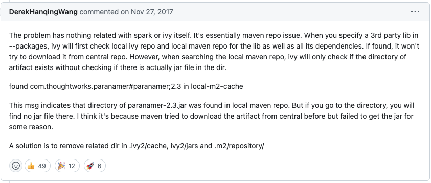

### My Code

``` Python
import sparknlp

if __name__ == '__main__':
    # Start Spark Session
    spark = sparknlp.start()
```

### Problem
When `sparknlp.start()` is invoked, a spark session is invoked on the background, which depends on several java jars dependencies.

But when looking for a package, maven will first check the local `ivy` and `maven` repos for the package (and for all the dependenies of that package).
***
<!--  -->

***
***

***

### Quick Solution
Remove the problematic package's directories in the *local* `ivy` and `maven` repos. On a mac, these repos are have the following locations:
  - `~/.ivy2/cache`
  - `~/.ivy2/jars`
  - `~/.m2/repository`

```
rm -rf ~/.ivy2/cache ~/.ivy2/jars ~/.m2/repository
```

### Long Answer
Apache Ivy is a dependency management tool that handles your project's dependencies - the JAR file. When requesting a package, Ivy will first look in your local Ivy repository, located at `~/ivy2/cache`, and if it does not find it downloads it from the *Maven 2* central repository.

Apache Maven is a dependency management **and build automation** tool for Java projects. Similar to Ivy, maven has a local repository for installed packages with location `~/.m2/repository`.

Now for some reason Ivy thinks that the package (in this case `commons-codec` and `httpcore`) are present in the local system (so in one of `~/ivy2/jars` and `~/.m2/repository`), but when it tries to download it it is not actually there.

Why? As per DerekHanqingWang's comment, *when searching the local maven repo, ivy will only check if the directory of the artifact exists without checking if there is actually jar file in the dir`. So in my case the artifact directory was there but it was empty with no jars inside! This means that (during the first request for this package) Ivy had failed to download the JAR, possibly due to a connection error, or due to my tendency to SIGKILL a process when it takes too long (which, in the context of the Ivy process, would lead to the artifact directory being created but the process terminating before the JAR is fully downloaded).

*NOTE*: Ivy does by default look for packages in `~/.m2/repository`, but this behaviour is likely specified in the underlying configuration hidden behind the `sparknlp.start()` invocation.

Therefore, what you can do is remove the artifact directories from the local maven/ivy repos, so that when ivy is looking for a package, it is not tricked by an empty directory artifact. If you want to fully clean your local repos, you can entirely remove them (ivy will refill them as packaged are needed).

I ran
```
rm -rf ~/.ivy2/cache ~/.ivy2/jars ~/.m2/repository
```
, which solved the problem.

$2x + y = 34$


$$
x = 4y + 8y + a 
$$

The truth is that `[a,b,c]` is a variable.


### Resources
- https://github.com/databricks/spark-redshift/issues/244
 
- https://stackoverflow.com/questions/19751614/unresolved-dependencies-for-commons-codec
- https://stackoverflow.com/questions/7408545/how-do-you-clear-apache-mavens-cache
- https://stackoverflow.com/questions/31866009/maven-local-cache-error


### For me:
- [ ] https://stackoverflow.com/questions/39645836/did-maven-killed-the-ant-or-it-is-still-alive
- [ ] https://stackoverflow.com/questions/603189/differences-between-ant-and-maven
- [ ] https://ant.apache.org/ivy/history/latest-milestone/tutorial/start.html
- [ ] https://wiki.c2.com/?AntVsMake
