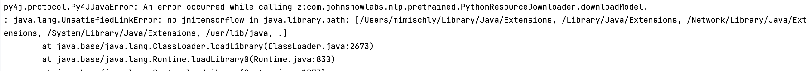
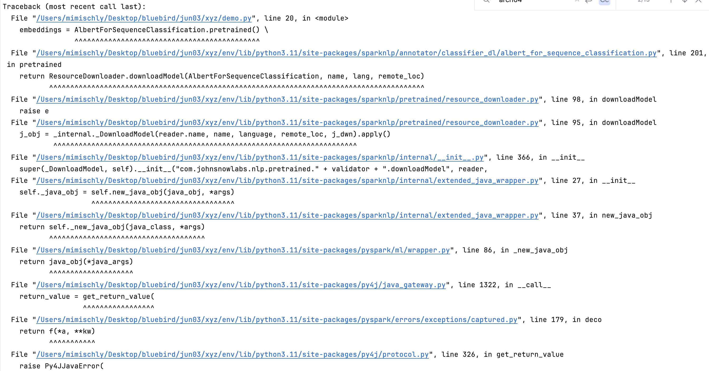

### My Code
``` Python
import sparknlp
from sparknlp.base import DocumentAssembler
from sparknlp.annotator import SentenceDetector, BertSentenceEmbeddings
from pyspark.ml import Pipeline

spark = sparknlp.start()

documentAssembler = DocumentAssembler() \
    .setInputCol("text") \
    .setOutputCol("document")
sentence = SentenceDetector() \
    .setInputCols(["document"]) \
    .setOutputCol("sentence")
embeddings = BertSentenceEmbeddings.pretrained() \
    .setInputCols(["sentence"]) \
    .setOutputCol("sentence_bert_embeddings") \
    .setCaseSensitive(True) \
    .setMaxSentenceLength(512)
pipeline = Pipeline(stages=[documentAssembler,
                            sentence,
                            embeddings])
```

### Problem
During downloading the model (happening with `BertSentenceEmbeddings.pretrained()...` ), the following error took place
***

***
with the traceback
***

***

## Take 1 (failed)
First, I thought that my default version of Java (17) could be the issue, since earlier versions of Spark (e.g. 3.2.2) do not support Java 17. I tried to change my default Java version from 17 to 8 (doing ```export JAVA_HOME=`/usr/libexec/java_home -v  1.8.411.09` ```) but this did not fix the problem.
The reason is that the spark version loaded when doing `sparknlp.start()` was 3.4.0, which does support version 17. I realized that by looking at the source code for `sparknlp.start()`. It turns out that this function essentially creates a SparkSession as follows:
```
SparkSession.builder \\
            .appName("Spark NLP") \\
            .master("local[*]") \\
            .config("spark.driver.memory", "16G") \\
            .config("spark.serializer", "org.apache.spark.serializer.KryoSerializer") \\
            .config("spark.kryoserializer.buffer.max", "2000M") \\
            .config("spark.driver.maxResultSize", "0") \\
            .config("spark.jars.packages", "com.johnsnowlabs.nlp:spark-nlp_2.12:|release|") \\
            .getOrCreate()
```

The key is the `com.johnsnowlabs.nlp:spark-nlp_2.12:[release]` dependency. By inspecting the entry of this package in `mvnrepository`(https://mvnrepository.com/artifact/com.johnsnowlabs.nlp/spark-nlp_2.12/5.3.3), it turns out that it uses Spark version `3.4.0` (as one of its dependencies).


## Take 2
Through inspection of the source code of `sparknlp.start()` and a bunch of Github issues and StackOverflow posts (linked below), I figured it out.

It turns out the problem had to do with my system. I am using an **M1** Mac ("silicon"), and the default `com.johnsnowlabs.nlp:spark-nlp_2.12:[release]` is incompatible with this architecture. It turns out that, under the same `groupId` of `com.johnsnowlabs.nlp`, there is also the package `com.johnsnowlabs.nlp:spark-nlp-silicon_2.12:[rel]`; spark nlp compatible with Apple silicon!

In fact, looking at the function signature of `sparknlp.start()`,
``` python
def start(gpu=False,
          apple_silicon=False,
          aarch64=False,
          memory="16G",
          cache_folder="",
          log_folder="",
          cluster_tmp_dir="",
          params=None,
          real_time_output=False,
          output_level=1):
```
, it turns out there is an `apple_silicon` optional parameter! Digging in the implementation, we see that by setting `apple_silicon=True` the silicon-specific package will be installed:
``` python
self.maven_silicon = "com.johnsnowlabs.nlp:spark-nlp-silicon_2.12:{}".format(current_version)

...
...
...

if apple_silicon:
    spark_jars_packages = spark_nlp_config.maven_silicon
elif aarch64:
    spark_jars_packages = spark_nlp_config.maven_aarch64
elif gpu:
    spark_jars_packages = spark_nlp_config.maven_gpu_spark3
else:
    spark_jars_packages = spark_nlp_config.maven_spark3
```
.

Moreover, it turns out the `groupId` also have a tensor-flow package specific to M1, namely
```
com.johnsnowlabs.nlp:tensorflow-m1_2.12:[rel]
```
, which you can add a JAR in addition to the spark-nlp package.
Therefore, we have two possible solutions:

### Solution 1
Specify the `apple_silicon=True` in the invocation of `sparknlp.start`.
``` python
sparknlp.start(apple_silicon=True)
```
Equivalently, if you are manually building your SparkSession, use `com.johnsnowlabs.nlp:spark-nlp-silicon_2.12:[rel]` or `com.johnsnowlabs.nlp:spark-nlp-m1_2.12:[rel]` instead of the default `com.johnsnowlabs.nlp:spark-nlp_2.12:[rel]`.
``` python
spark = SparkSession.builder \
           .appName("Spark NLP") \
           ...
           ...
           ...
           .config("spark.jars.packages",
                   "com.johnsnowlabs.nlp:spark-nlp-silicon_2.12:[rel],") \
           .getOrCreate()
```

### Solution 2
If you are manually creating your `SparkSession` and are using the deafault spark-nlp package `com.johnsnowlabs.nlp:spark-nlp_2.12:[rel]`, add as another JAR dependency the package `com.johnsnowlabs.nlp:tensorflow-m1_2.12:[rel]`, so you will have:
``` python
spark = SparkSession.builder \
           .appName("Spark NLP") \
           ...
           ...
           ...
           .config("spark.jars.packages",
                   "com.johnsnowlabs.nlp:spark-nlp_2.12:[rel],"
                   "com.johnsnowlabs.nlp:tensorflow-m1_2.12:[rel]") \
           .getOrCreate()
```

Related Resources:
 - https://github.com/JohnSnowLabs/spark-nlp/discussions/2282
 - https://github.com/JohnSnowLabs/spark-nlp/issues/13079
 -


For Me:
 - [ ] https://docs.elementscompiler.com/Platforms/Cocoa/CpuArchitectures/#:~:text=On%20macOS%2C%20two%20architecture%20are,in%20late%202020%20and%20beyond.
