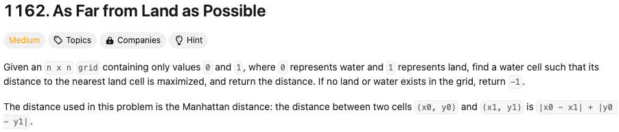

### Idea (round #1):
  Translate the grid of 0's and 1's (representing water and land, respectively) into an undirected bicolored graph - where white corresponds to 0 (water) and black represents to 1 (land). This would require producing to sets, `V` (for the notes) and `E` (for the edges). Then, given the graph structure, we can run BFS on each water node to find the nearest land node.


``` python
# BFS search from my recollection

V = {nodes}
E = {edges}

Q = {empty queue}
Q.enqueue(v)


while Q is not empty:
  val = Q.dequeue(v)
  for n in v.neighbours:
    if n.color == W:
      Q.enqueue(n)
      n.p = val


###########################################

Q = {empty queue}
Q.enqueue(v)

dist = 0
while Q is not empty:
  dist += 1
  val = Q.dequeue(v)
  for n in v.neighbours:
    if n.land = true:
      return dist
    if n.color == W:
      Q.enqueue(n)
return -1


```


***
***
***

## Try 1: *34/38* tests passed due to time limits
```
import pprint
from Queue import Queue

class Solution(object):
    def maxDistance(self, grid):
        """
        :type grid: List[List[int]]
        :rtype: int
        """
        node_grid = [[Node(r,c, color=grid[r][c]) for c in range(len(grid[r]))] for r in range(len(grid))]
        G = make_graph(node_grid)

        return max([
            nearest_land_for(node_grid[r][c], G, grid) for c in range(len(grid[r])) for r in range(len(grid))
            ])

        return d

def make_graph(node_grid):
    G = dict()
    height = len(node_grid)
    width = len(node_grid[0])
    for r in range(height):
        for c in range(width):
            neighs = set()
            curr = node_grid[r][c]
            if r > 0:
                up = node_grid[r-1][c]
                neighs.add(up)
            if r < height - 1:
                down = node_grid[r+1][c]
                neighs.add(down)
            if c > 0:
                left = node_grid[r][c-1]
                neighs.add(left)
            if c < width - 1:
                right = node_grid[r][c+1]
                neighs.add(right)
            G[curr] = neighs
    return G

## Let's use a list for queue for now
def nearest_land_for(v, G, grid):
    v.d = 0
    queue = Queue()
    queue.put(v)

    visited = set()

    while not queue.empty():
        val = queue.get()
        if val.color == 1:
            return val.d

        print(G.keys())
        for neigh in G[val]:
            if neigh not in visited:
                neigh.d = val.d + 1
                queue.put(neigh)
                visited.add(neigh)
    return -1

class Node:
    def __init__(self, r, c, d=-1, color=None):
        self.r = r
        self.c = c
        self.d = d
        self.color = color

    def get_row(self):
        return self.r

    def get_col(self):
        return self.c

    def __str__(self):
        return "("+str(self.r) + ", " + str(self.c) + ", " + str(self.color) + ")"

    def __repr__(self):
        return "("+str(self.r) + ", " + str(self.c) + ", " + str(self.color) + ")"
```
Notes:
  - I decided to make a Node class to encapculate information, especially the distance (so that to increment the `d` of a node during the BFS you do
    `parent.d + 1`). **I could not think of a way to globally track the distance (i.e. during the BFS,
      without making it an attribute of each node), to know, at any point during the BFS, at what distance you are standing**.
